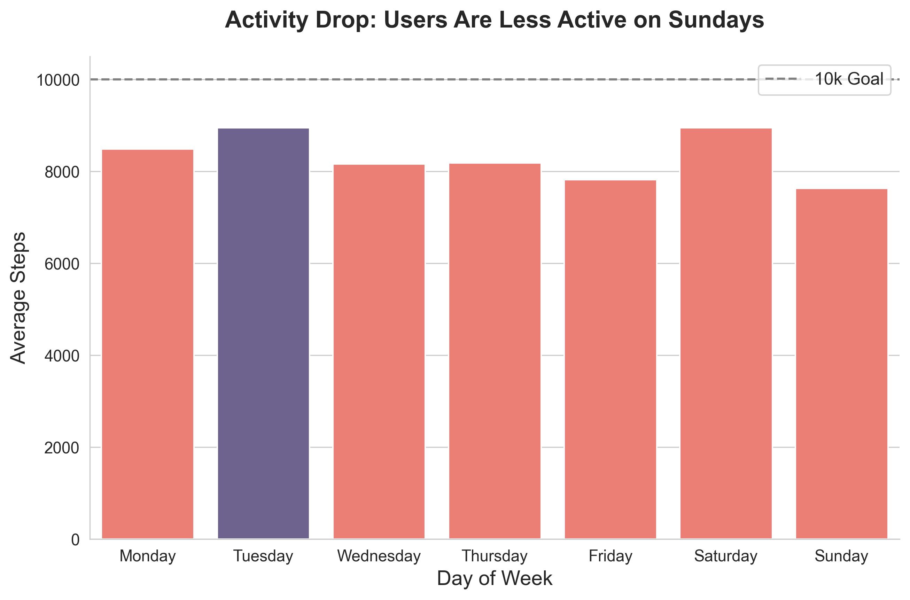

# Bellabeat Data Analysis Case Study

## Project Overview
**Role:** Junior Data Analyst  
**Goal:** Analyze smart device usage data to identify trends and unlock new growth opportunities for Bellabeat, a high-tech manufacturer of health-focused products for women.
**Tools:** Python (Pandas, Matplotlib, Seaborn)

## Files
* `bellabeat_analysis.ipynb`: The complete Python analysis notebook.
* [Data Source](https://www.kaggle.com/datasets/arashnic/fitbit/data): FitBit Fitness Tracker Data (Public Domain via Kaggle).

## Key Insights & Visualizations
1.  **The "Weekend Warrior" Trend:** Users are most active on Saturdays and Tuesdays but drop off significantly on Sundays.

2.  **The Sedentary Cycle:** The average user spends **16 hours/day** sedentary.
3.  **The Sleep Trade-off:** There is a strong negative correlation (**-0.60**) between sedentary time and sleep. Users aren't sleeping less because they are active; they are losing sleep to sedentary behavior.

## Recommendations
* **Wind-Down Alerts:** Introduce app notifications to break "sedentary loops" in the evening (7-9 PM).
* **Sunday Recovery:** Launch "Active Recovery" marketing campaigns to boost Sunday engagement.
* **Holistic Wellness:** Position products not just as fitness trackers, but as "Rest & Recovery" guardians.