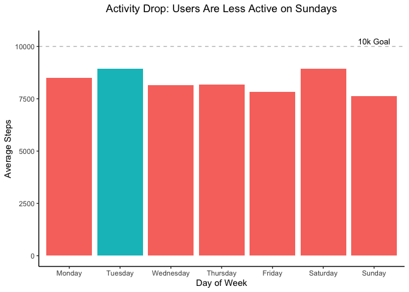
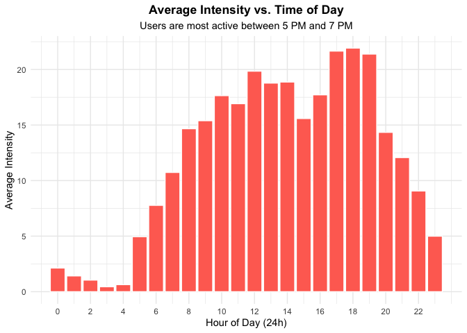
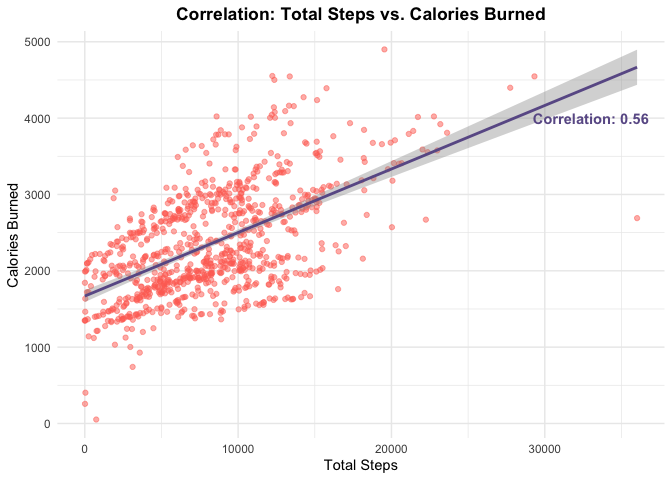
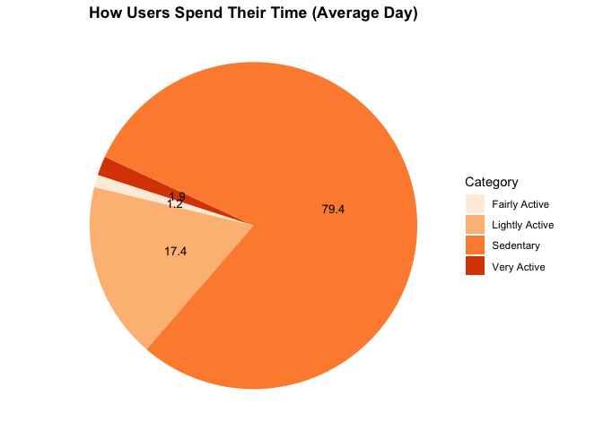
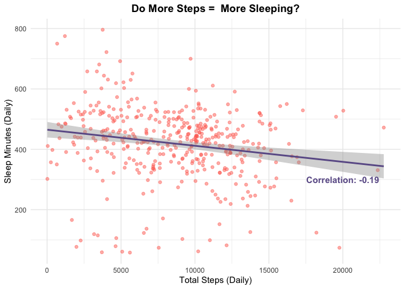
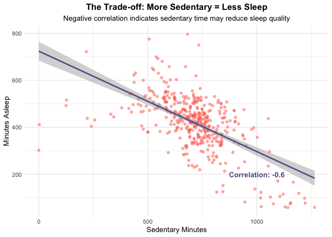

# Bellabeat Wellness Analysis
Azhar Fachrezi
2026-01-06

- [1. Ask](#1-ask)
- [2. Prepare](#2-prepare)
- [3. Process](#3-process)
- [4. Analyze & Share](#4-analyze--share)
- [5. Act (Recommendations)](#5-act-recommendations)
  - [1. The “Wind-Down” Feature](#1-the-wind-down-feature)
  - [2. “Weekend Warrior” Campaigns](#2-weekend-warrior-campaigns)
  - [3. Educate on “Hidden Sedentary”
    Time](#3-educate-on-hidden-sedentary-time)

## 1. Ask

**Business Task:** Analyze smart device usage data from non-Bellabeat
consumers to discover trends that can guide Bellabeat’s marketing
strategy.

**The Goal:** To answer: *“How can these trends help influence Bellabeat
marketing strategy?”*

------------------------------------------------------------------------

## 2. Prepare

**Dataset Used:** Fitbit Fitness Tracker Data (CC0: Public Domain, via
Mobius on Kaggle) **Scope:** 33 users, April–May 2016

**Files Used:**

- dailyActivity_merged.csv

- sleepDay_merged.csv

  NOTE: Datasets can be accessed through this
  [link](https://www.kaggle.com/datasets/arashnic/fitbit/data).

**Tools:** R Programming Language

**Limitations:** Small sample size, limited demographic data, short time
frame.

<details class="code-fold">
<summary>Code</summary>

``` r
# Load the datasets
base_path <- "bellabeat_data/mturkfitbit_export_4.12.16-5.12.16/Fitabase Data 4.12.16-5.12.16/"

daily_activity <- read_csv(file.path(base_path, "dailyActivity_merged.csv"))
hourly_calories <- read_csv(file.path(base_path, "hourlyCalories_merged.csv"))
hourly_intensities <- read_csv(file.path(base_path, "hourlyIntensities_merged.csv"))
sleep_day <- read_csv(file.path(base_path, "sleepDay_merged.csv"))
```

</details>

------------------------------------------------------------------------

## 3. Process

**cleaning and wrangling the data:**

1.  Checked for duplicates and missing values.
2.  Filter out zero step day.
3.  Converted date columns to datetime format.
4.  Created new features (`DayofWeek`).

**Data Integrity Check:**

- Expectation vs. Reality: The documentation claimed 30 users, but my
  validation discovered 33 unique IDs.

- Decision: I will keep all 33 users to maximize the sample size, but
  I’ve noted this discrepancy as a limitation to be aware of.

- The “Zero” Problem: I identified 77 days where users logged 0 steps.

- Action: These rows were removed because they likely represent days the
  device wasn’t worn, which would skew the daily activity averages
  downward incorrectly.

<details class="code-fold">
<summary>Code</summary>

``` r
print(glue("Total of unique users: {length(unique(daily_activity$Id))}"))
```

</details>

    Total of unique users: 33

> The Dataset description said there are 30 users, but with this
> revealed that there are 33 users.

<details class="code-fold">
<summary>Code</summary>

``` r
print(glue("Total of rows with zero steps: {sum(daily_activity$TotalSteps == 0)}"))
```

</details>

    Total of rows with zero steps: 77

> Seems like there are **77 rows** with **0 steps**, it’s probably
> because they didn’t wear the device that day or the battery died. If i
> keep them, it will drag the average steps down, so i decided to filter
> them out to get an accurate picture of **active usage**.

<details class="code-fold">
<summary>Code</summary>

``` r
# PIPELINE: Clean -> Feature Engineer -> Filter -> Merge

# Clean daily_activity
daily_activity <- daily_activity %>%
    clean_names() %>%
    mutate(activity_date = mdy(activity_date))

# Add a 'day_of_week' column
daily_activity <- daily_activity %>%
    mutate(day_of_week = wday(activity_date, label=TRUE, abbr=FALSE))

# Filter out days with zero step
daily_activity_clean <- daily_activity %>% filter(total_steps > 0)

# Clean hourly_calories
hourly_calories <- hourly_calories %>%
    clean_names() %>%
    mutate(activity_hour = mdy_hms(activity_hour))

# Clean hourly_intensities
hourly_intensities <- hourly_intensities %>%
    clean_names() %>%
    mutate(activity_hour = mdy_hms(activity_hour))

# Clean Sleep Data
sleep_day <- sleep_day %>%
    clean_names() %>%
    mutate(activity_date = mdy_hms(sleep_day)) %>%
    mutate(activity_date = as_date(activity_date))

# Merge with Daily Activity
daily_sleep_merged <- inner_join(daily_activity_clean, sleep_day, by= c("id", "activity_date"))

# Merge hourly calories and intensities
hourly_merged <- left_join(hourly_calories, hourly_intensities, by= c("id", "activity_hour"))
```

</details>

> **Data Cleaning and Transformation:** To ensure data integrity and
> prepare the datasets for analysis, I performed the following steps:
>
> - **Standardization:** Cleaned column names to `snake_case` and
>   converted date strings into proper Date/Time objects
>   using `lubridate`.
>
> - **Feature Engineering:** Created a `day_of_week` column to analyze
>   activity patterns by day (e.g., weekends vs. weekdays).
>
> - **Data Quality:** Filtered out records with `0` total steps,
>   assuming these represent days where the user did not wear the
>   device, which would skew our daily averages.
>
> - **Merging:** Joined the Activity, Sleep, and Hourly datasets to
>   allow for cross-analysis (e.g., seeing how activity levels impact
>   sleep quality).

------------------------------------------------------------------------

## 4. Analyze & Share

Now that the data is clean (duplicates removed, dates formatted), we
will look for **3 key patterns:**

1.  **Usage Habits:** When are users most active?

2.  **Intensity:** Do steps equal calories, or does intensity matter?

3.  **The “Hidden” Cost:** How does sedentary time affect sleep?

**Key Insight:**

- **The Trend:** Users are most active on Tuesdays and Saturdays, but
  activity drops significantly on Sundays.

- **The Gap:** The average user takes ~8,319 steps, falling just short
  of the common 10,000-step health goal. This “gap” is a marketing
  opportunity.

<details class="code-fold">
<summary>Code</summary>

``` r
print(glue("Average user steps: {round(mean(daily_activity_clean$total_steps), digits = 2)}"))
```

</details>

    Average user steps: 8319.39

> The average steps are ~**8319** while the general health
> recommendation is often **10,000** steps/day. Let’s analyze deeper to
> see day per day activity.

<details class="code-fold">
<summary>Code</summary>

``` r
# Order the days
day_order <- c("Monday", "Tuesday", "Wednesday", "Thursday", "Friday", "Saturday", "Sunday")


# Grouping
daily_stats <- daily_activity_clean %>%
    group_by(day_of_week) %>%
    summarise(
       total_steps = mean(total_steps),
       calories = mean(calories)
    ) %>%
    mutate(day_of_week = factor(day_of_week, levels = day_order))

# Plotting
max_steps <- max(daily_stats$total_steps)

ggplot(daily_stats, aes(x = day_of_week, y = total_steps, fill = total_steps == max_steps)) +
    geom_col() +
    guides(fill = "none") +
    geom_hline(aes(yintercept = 10000), color="gray", linetype = "dashed") +
    annotate(
        geom = "text",
        x = 7,
        y = 10250,
        label = "10k Goal",
        color = "black",
        size = 3.5
    ) +
    labs(
        title = "Activity Drop: Users Are Less Active on Sundays",
        x = "Day of Week",
        y = "Average Steps"
    ) +
    theme_classic() +
    theme(
        plot.title = element_text(hjust = 0.5, margin = margin(b = 20))      
    )
```

</details>



> From the chart above, i can assume: \* **Tuesday Peak**: Likely people
> hitting the gym or walking during their work routine \* **Saturday
> Peak**: Active leisure on weekend \* **Sunday Slump**: The “rest day”

<details class="code-fold">
<summary>Code</summary>

``` r
# Extract hour from the datetime column
hourly_grouped <- hourly_merged %>%
  mutate(hour = hour(activity_hour)) %>%
  group_by(hour) %>%
  summarise(avg_intensity = mean(total_intensity))

# Visualize: Average Intensity by Hour
ggplot(data = hourly_grouped, aes(x = hour, y = avg_intensity)) +
  geom_col(fill = "#FF6F61", color = "white") +
  labs(title = "Average Intensity vs. Time of Day",
       subtitle = "Users are most active between 5 PM and 7 PM",
       x = "Hour of Day (24h)",
       y = "Average Intensity") +
  scale_x_continuous(breaks = seq(0, 23, 2)) + # Label every 2 hours
  theme_minimal() +
  theme(
      plot.title =  element_text(hjust = 0.5, face="bold"),
      plot.subtitle = element_text(hjust = 0.5)
  )
```

</details>



> Based on the chart above, users most likely started to exercise after
> going home from work (around 5 PM - 7 PM).

<details class="code-fold">
<summary>Code</summary>

``` r
cor_value <- cor(daily_activity_clean$total_steps, daily_activity_clean$calories)

ggplot(daily_activity_clean, aes(x = total_steps, y = calories)) +
    geom_point(color = "#FF6F61", alpha = 0.5) +
    geom_smooth(method = "lm", color = "#6B5B95") +
    annotate(
        "text",
        x = 33000,
        y = 4000,
        label = paste("Correlation:", round(cor_value, 2)),
        color = "#6B5B95", fontface = "bold"
    ) +
    labs(
        title = "Correlation: Total Steps vs. Calories Burned",
        x = "Total Steps",
        y = "Calories Burned"
    ) +
    theme_minimal() +
    theme(
        plot.title = element_text(hjust = 0.5, face = "bold")
    )
```

</details>



> Solid moderate positive correlation (0.56). That means **more steps
> more calories burned**.

<details class="code-fold">
<summary>Code</summary>

``` r
# Calculate average minutes
minutes_col = c("very_active_minutes", "fairly_active_minutes", "lightly_active_minutes", "sedentary_minutes")
avg_minutes <- colMeans(daily_activity_clean[minutes_col], na.rm=TRUE)

# Convert to df
avg_minutes_df <- data.frame(
    Category = c("Very Active", "Fairly Active", "Lightly Active", "Sedentary"),
    AverageMinutes = as.numeric(avg_minutes)) %>%
    mutate(
        Percentage = round((AverageMinutes / sum(AverageMinutes)) * 100, 1)
    )

# Pie Chart
ggplot(avg_minutes_df, aes(x="", y=AverageMinutes, fill=Category)) +
    geom_bar(width = 1, stat = "identity") +
    coord_polar("y", start = 1.6 * pi) +  # Convert bar chart into pie chart
    scale_fill_brewer(palette = "Oranges") +
    geom_text(aes(label = Percentage),
             position = position_stack(vjust = 0.5),
             color = "black",
             size = 3.5) +
    labs(
        title = "How Users Spend Their Time (Average Day)"
    ) +
    theme_void() +
    theme(
        plot.title = element_text(hjust = 0.5, face="bold"),
        legend.position = "right"
    )
```

</details>



> Average **Sedentary** is surprisingly high, *~955 minutes* that means
> *~16 hours* a day sedentary (sitting/office/commute/etc) and they have
> **~8 hours** left for everything else (sleep + exercise). This insight
> suggest users likely trading sleep for sedentary time (revenge bedtime
> procrastination)?.

<details class="code-fold">
<summary>Code</summary>

``` r
avg_sleep <- round(mean(daily_sleep_merged$total_minutes_asleep)/60, 2)
print(glue("Average users' sleep time: {avg_sleep} hours"))
```

</details>

    Average users' sleep time: 6.99 hours

> Average users’ sleep time are ~*7 hours*. This shows that average
> users has enough sleep time (general sleep recommendation is 7-9 hours
> for most adults).

<details class="code-fold">
<summary>Code</summary>

``` r
# Calculate corr between total steps and sleep length
cor_value <- cor(daily_sleep_merged$total_steps, daily_sleep_merged$total_minutes_asleep)

# Visualize
ggplot(daily_sleep_merged, aes(x = total_steps, y = total_minutes_asleep)) +
    geom_point(color = "#FF6F61", alpha = 0.5) +  
    geom_smooth(method = "lm", color = "#6B5B95") +
    annotate(
        "text",
        x = 20000,
        y =300,
        label = paste("Correlation:", round(cor_value, 2)),
        color = "#6B5B95",
        fontface = "bold"
    ) +
    labs(
        title = "Do More Steps =  More Sleeping?",
        x = "Total Steps (Daily)",
        y = "Sleep Minutes (Daily)"
    ) +
    theme_minimal() +
    theme(
        plot.title = element_text(hjust = 0.5, face = "bold")
    )
```

</details>



> **-0.19 correlation** essentially means **“Walking more does NOT
> guarantee better sleep.”** In fact, on days when users walk a ton,
> they might actually sleep slightly less (maybe because they are busy,
> over-scheduled, or staying up late to finish tasks).

<details class="code-fold">
<summary>Code</summary>

``` r
# Calculate the correlation coefficient
cor_value <- cor(daily_sleep_merged$sedentary_minutes, daily_sleep_merged$total_minutes_asleep)

# Visualize: Sedentary Minutes vs. Sleep
ggplot(data = daily_sleep_merged, aes(x = sedentary_minutes, y = total_minutes_asleep)) +
  geom_point(color = "#FF6F61", alpha = 0.5) +  # Bellabeat color (Coral)
  geom_smooth(method = "lm", color = "#6B5B95") + # Trend line (Purple)
  annotate("text", x = 1000, y = 200, 
           label = paste("Correlation:", round(cor_value, 2)), 
           color = "#6B5B95", fontface = "bold") +
  labs(title = "The Trade-off: More Sedentary = Less Sleep",
       subtitle = "Negative correlation indicates sedentary time may reduce sleep quality",
       x = "Sedentary Minutes",
       y = "Minutes Asleep") +
  theme_minimal() +
  theme(
      plot.title = element_text(hjust = 0.5, face="bold"),
      plot.subtitle = element_text(hjust = 0.5)
  )
```

</details>



> **Key Insight: The “Sedentary Cycle”** \* **The Stats:** Users spend
> approx. **16 hours a day** sedentary. \* **The Consequence:** There is
> a **strong negative correlation (-0.60)** between sedentary minutes
> and sleep. \* **Conclusion:** Users aren’t necessarily “lazy”—they are
> active, but their high sedentary time (likely screen time or office
> work) is eating directly into their sleep window.

------------------------------------------------------------------------

## 5. Act (Recommendations)

Based on the **strong negative correlation (-0.60)** between Sedentary
Time and Sleep, here are my top 3 recommendations for the Bellabeat
Marketing Strategy:

### 1. The “Wind-Down” Feature

- **Insight:** Users who sit more than 10 hours a day sleep
  significantly less.
- **Strategy:** Update the Bellabeat App to send **“Movement Breaks”**
  specifically in the evening (7 PM - 9 PM) to break the sedentary loop
  before bed.

### 2. “Weekend Warrior” Campaigns

- **Insight:** Activity peaks on Tuesdays and Saturdays but drops on
  Sundays.
- **Strategy:** Send Sunday morning notifications encouraging “Active
  Recovery” (yoga, light walks) to maintain consistency.

### 3. Educate on “Hidden Sedentary” Time

- **Insight:** Users spend ~16 hours sedentary, often without realizing
  it.
- **Strategy:** Market the Bellabeat Leaf/Time not just as a fitness
  tracker, but as a **“Wellness Alarm”** that tracks inactivity, not
  just activity.

> **Key Insight: The Strategy Pivot** \* **Old Strategy:** Focus on “Get
> Active” (Step Counts). \* **New Strategy:** Focus on **“Holistic
> Balance”** (Rest & Recovery). \* **Why:** Our users are already
> walking ~8k steps. The bigger problem and the unique value proposition
> for Bellabeat is helping them manage the **16 hours of sedentary
> time** that is hurting their sleep.
