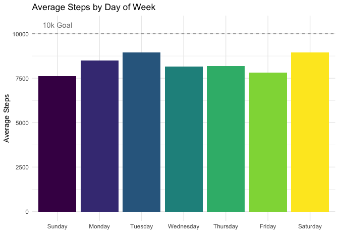
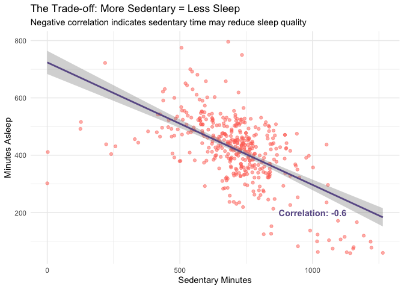

# Bellabeat Wellness Analysis
Azhar Fachrezi
2026-01-06

- [1. Ask](#1-ask)
- [2. Prepare](#2-prepare)
- [3. Process](#3-process)
- [4. Analyze & Share](#4-analyze--share)

## 1. Ask

**Business Task:** Analyze smart device usage data from non-Bellabeat
consumers to discover trends that can guide Bellabeat’s marketing
strategy.

**The Goal:** To answer: *“How can these trends help influence Bellabeat
marketing strategy?”*

------------------------------------------------------------------------

## 2. Prepare

**Dataset Used:** Fitbit Fitness Tracker Data (CC0: Public Domain, via
Mobius on Kaggle) **Scope:** 33 users, April–May 2016

**Files Used:**

- dailyActivity_merged.csv

- sleepDay_merged.csv

  NOTE: Datasets can be accessed through this
  [link](https://www.kaggle.com/datasets/arashnic/fitbit/data).

**Tools:** R Programming Language

**Limitations:** Small sample size, limited demographic data, short time
frame.

<details class="code-fold">
<summary>Code</summary>

``` r
# Load the datasets
base_path <- "bellabeat_data/mturkfitbit_export_4.12.16-5.12.16/Fitabase Data 4.12.16-5.12.16/"

daily_activity <- read_csv(file.path(base_path, "dailyActivity_merged.csv"))
```

</details>

    Rows: 940 Columns: 15
    ── Column specification ────────────────────────────────────────────────────────
    Delimiter: ","
    chr  (1): ActivityDate
    dbl (14): Id, TotalSteps, TotalDistance, TrackerDistance, LoggedActivitiesDi...

    ℹ Use `spec()` to retrieve the full column specification for this data.
    ℹ Specify the column types or set `show_col_types = FALSE` to quiet this message.

<details class="code-fold">
<summary>Code</summary>

``` r
hourly_calories <- read_csv(file.path(base_path, "hourlyCalories_merged.csv"))
```

</details>

    Rows: 22099 Columns: 3
    ── Column specification ────────────────────────────────────────────────────────
    Delimiter: ","
    chr (1): ActivityHour
    dbl (2): Id, Calories

    ℹ Use `spec()` to retrieve the full column specification for this data.
    ℹ Specify the column types or set `show_col_types = FALSE` to quiet this message.

<details class="code-fold">
<summary>Code</summary>

``` r
hourly_intensities <- read_csv(file.path(base_path, "hourlyIntensities_merged.csv"))
```

</details>

    Rows: 22099 Columns: 4
    ── Column specification ────────────────────────────────────────────────────────
    Delimiter: ","
    chr (1): ActivityHour
    dbl (3): Id, TotalIntensity, AverageIntensity

    ℹ Use `spec()` to retrieve the full column specification for this data.
    ℹ Specify the column types or set `show_col_types = FALSE` to quiet this message.

<details class="code-fold">
<summary>Code</summary>

``` r
sleep_day <- read_csv(file.path(base_path, "sleepDay_merged.csv"))
```

</details>

    Rows: 413 Columns: 5
    ── Column specification ────────────────────────────────────────────────────────
    Delimiter: ","
    chr (1): SleepDay
    dbl (4): Id, TotalSleepRecords, TotalMinutesAsleep, TotalTimeInBed

    ℹ Use `spec()` to retrieve the full column specification for this data.
    ℹ Specify the column types or set `show_col_types = FALSE` to quiet this message.

------------------------------------------------------------------------

## 3. Process

**cleaning and wrangling the data:**

1.  Checked for duplicates and missing values.
2.  Filter out zero step day.
3.  Converted date columns to datetime format.
4.  Created new features (`DayofWeek`).

**Data Integrity Check:**

- Expectation vs. Reality: The documentation claimed 30 users, but my
  validation discovered 33 unique IDs.

- Decision: I will keep all 33 users to maximize the sample size, but
  I’ve noted this discrepancy as a limitation to be aware of.

- The “Zero” Problem: I identified 77 days where users logged 0 steps.

- Action: These rows were removed because they likely represent days the
  device wasn’t worn, which would skew the daily activity averages
  downward incorrectly.

<details class="code-fold">
<summary>Code</summary>

``` r
# Clean daily_activity
daily_activity <- daily_activity %>%
    clean_names() %>%
    mutate(activity_date = mdy(activity_date))

# Add a 'day_of_week' column
daily_activity <- daily_activity %>%
    mutate(day_of_week = wday(activity_date, label=TRUE, abbr=FALSE))

# Filter out days with zero step
daily_activity_clean <- daily_activity %>% filter(total_steps > 0)

# Clean hourly_calories
hourly_calories <- hourly_calories %>%
    clean_names() %>%
    mutate(activity_hour = mdy_hms(activity_hour))

# Clean hourly_intensities
hourly_intensities <- hourly_intensities %>%
    clean_names() %>%
    mutate(activity_hour = mdy_hms(activity_hour))

# Clean Sleep Data
sleep_day <- sleep_day %>%
    clean_names() %>%
    mutate(activity_date = mdy_hms(sleep_day)) %>%
    mutate(activity_date = as_date(activity_date))

# Merge with Daily Activity
daily_sleep_merged <- inner_join(daily_activity_clean, sleep_day, by= c("id", "activity_date"))

# Merge hourly calories and intensities
hourly_merged <- left_join(hourly_calories, hourly_intensities, by= c("id", "activity_hour"))
```

</details>

------------------------------------------------------------------------

## 4. Analyze & Share

Now that the data is clean (duplicates removed, dates formatted), we
will look for **3 key patterns:**

1.  **Usage Habits:** When are users most active?

2.  **Intensity:** Do steps equal calories, or does intensity matter?

3.  **The “Hidden” Cost:** How does sedentary time affect sleep?

**Key Insight:**

- **The Trend:** Users are most active on Tuesdays and Saturdays, but
  activity drops significantly on Sundays.

- **The Gap:** The average user takes ~8,319 steps, falling just short
  of the common 10,000-step health goal. This “gap” is a marketing
  opportunity.

<details class="code-fold">
<summary>Code</summary>

``` r
print(glue("Average user steps: {round(mean(daily_activity_clean$total_steps), digits = 2)}"))
```

</details>

    Average user steps: 8319.39

> The average steps are ~**8319** while the general health
> recommendation is often **10,000** steps/day. Let’s analyze deeper to
> see day per day activity.

<details class="code-fold">
<summary>Code</summary>

``` r
daily_activity_clean %>%
    group_by(day_of_week) %>%
    summarise(avg_steps = mean(total_steps)) %>%
    ggplot(aes(x = day_of_week, y = avg_steps, fill = day_of_week)) +
    geom_col() +
    geom_hline(yintercept = 10000, linetype = "dashed", color = "gray50") + # Add line at 10k
    annotate("text", x = 1, y = 10500, label = "10k Goal", color = "gray50") +
    labs(title = "Average Steps by Day of Week",
        y = "Average Steps",
        x = "") +
    theme_minimal() +
    theme(legend.position = "none")
```

</details>



<details class="code-fold">
<summary>Code</summary>

``` r
# Calculate the correlation coefficient
cor_value <- cor(daily_sleep_merged$sedentary_minutes, daily_sleep_merged$total_minutes_asleep)

# Visualize: Sedentary Minutes vs. Sleep
ggplot(data = daily_sleep_merged, aes(x = sedentary_minutes, y = total_minutes_asleep)) +
  geom_point(color = "#FF6F61", alpha = 0.5) +  # Bellabeat color (Coral)
  geom_smooth(method = "lm", color = "#6B5B95") + # Trend line (Purple)
  annotate("text", x = 1000, y = 200, 
           label = paste("Correlation:", round(cor_value, 2)), 
           color = "#6B5B95", fontface = "bold") +
  labs(title = "The Trade-off: More Sedentary = Less Sleep",
       subtitle = "Negative correlation indicates sedentary time may reduce sleep quality",
       x = "Sedentary Minutes",
       y = "Minutes Asleep") +
  theme_minimal()
```

</details>

    `geom_smooth()` using formula = 'y ~ x'



<details class="code-fold">
<summary>Code</summary>

``` r
# Extract hour from the datetime column
hourly_grouped <- hourly_merged %>%
  mutate(hour = hour(activity_hour)) %>%
  group_by(hour) %>%
  summarise(avg_intensity = mean(total_intensity))

# Visualize: Average Intensity by Hour
ggplot(data = hourly_grouped, aes(x = hour, y = avg_intensity)) +
  geom_col(fill = "#FF6F61", color = "white") +
  labs(title = "Average Intensity vs. Time of Day",
       subtitle = "Users are most active between 5 PM and 7 PM",
       x = "Hour of Day (24h)",
       y = "Average Intensity") +
  scale_x_continuous(breaks = seq(0, 23, 2)) + # Label every 2 hours
  theme_minimal()
```

</details>


